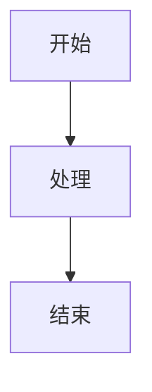

<!-- 文章头部元信息显示 -->
<div class="article-meta">
  
  <span class="author-name">zhanbingli</span>
  <span class="meta-divider">|</span>
  <span class="publish-date">{{ page.meta.date }}</span>
  <span class="meta-divider">|</span>
  <span class="read-time">阅读时间: {{ page.meta.readtime }} 分钟</span>
</div>

# 文章标题

<!-- 摘要 -->

这里是文章摘要，会显示在博客列表中。

<!-- more -->

## 引言

在这里，您可以介绍文章的主题、背景和目的。引言应当简明扼要，吸引读者继续阅读。

## 正文

在正文部分，您可以详细阐述文章的主要内容。可以分为多个子标题进行组织，使结构更加清晰。

### 小标题1

内容...

### 小标题2

内容...

## 总结

在总结部分，您可以重申文章的主要观点，并提出一些见解或建议。

<!-- 注释：以下是一些常用的Markdown扩展功能示例 -->

## Markdown扩展功能示例

### 1. 提示框

!!! note "提示"
    这是一个提示框

!!! tip "技巧"
    这是一个技巧提示

!!! warning "警告"
    这是一个警告提示

!!! danger "危险"
    这是一个危险提示

### 2. 代码高亮

```python
def hello_world():
    print("Hello, World!")
```

### 3. 任务列表

- [x] 已完成任务
- [ ] 未完成任务

### 4. 表格

| 名称 | 描述 |
| ---- | ---- |
| 项目1 | 描述1 |
| 项目2 | 描述2 |

### 5. 流程图 (Mermaid)



### 6. 标注

这是一个带有标注的句子。[^1]

[^1]: 这是标注内容。

### 7. 按键显示

按下 ++ctrl+alt+del++ 组合键。

### 8. 文本修饰

这是==高亮文本==，这是~~删除线文本~~。

这是^上标^文本，这是~下标~文本。

<!-- 在文章底部引入社交分享按钮 -->

