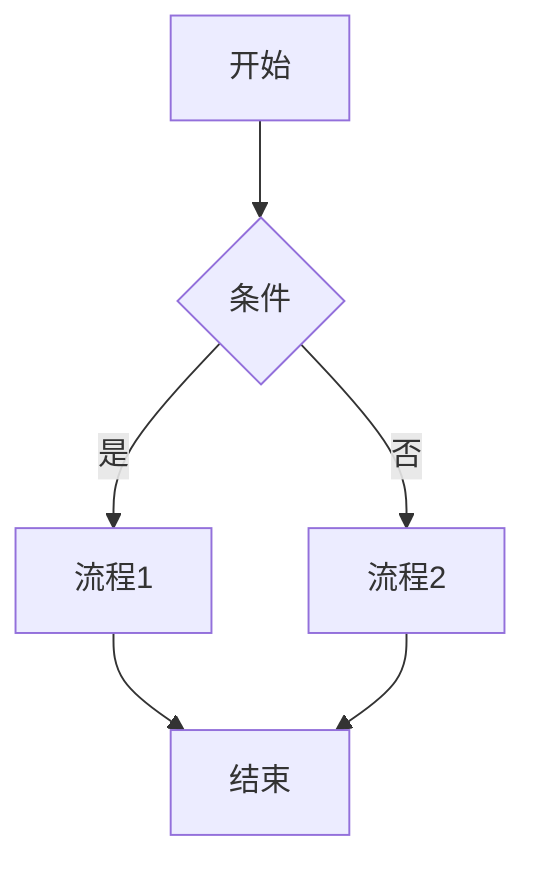

# Markdown 使用指南

Markdown 是一种轻量级标记语言，创建于2004年，现在已经成为世界上最流行的标记语言之一。它允许人们使用易读易写的纯文本格式编写文档，然后转换成有效的HTML文档。

## 基础语法

### 标题

```markdown
# 一级标题
## 二级标题
### 三级标题
#### 四级标题
##### 五级标题
###### 六级标题
```

### 强调

```markdown
*斜体* 或 _斜体_
**粗体** 或 __粗体__
**_粗斜体_** 或 ***粗斜体***
~~删除线~~
```

### 列表

无序列表：

```markdown
- 项目1
- 项目2
  - 子项目1
  - 子项目2
```

有序列表：

```markdown
1. 第一项
2. 第二项
   1. 子项目1
   2. 子项目2
```

### 链接

```markdown
[链接文本](https://www.example.com)
[带标题的链接](https://www.example.com "链接标题")
```

### 图片

```markdown

```

### 引用

```markdown
> 这是一段引用文本。
> 
> 这是引用的第二段。
```

### 代码

行内代码：

```markdown
`code`
```

代码块：

````markdown
```javascript
function hello() {
  console.log("Hello, world!");
}
```
````

### 水平线

```markdown
---
```

## 扩展语法

### 表格

```markdown
| 表头1 | 表头2 | 表头3 |
|-------|-------|-------|
| 单元格 | 单元格 | 单元格 |
| 单元格 | 单元格 | 单元格 |
```

### 任务列表

```markdown
- [x] 已完成任务
- [ ] 未完成任务
- [ ] 待办事项
```

### 脚注

```markdown
这是一个带有脚注的文本[^1]。

[^1]: 这是脚注的内容。
```

### 上标和下标

```markdown
H~2~O（下标）
X^2^（上标）
```

## MkDocs Material 特有功能

### 提示框

```markdown
!!! note "标题"
    这是一个提示框。

!!! warning "警告"
    这是一个警告提示框。
```

### 代码标签页

```markdown
=== "C"
    ```c
    #include <stdio.h>

    int main(void) {
      printf("Hello world!\n");
      return 0;
    }
    ```

=== "Python"
    ```python
    print("Hello world!")
    ```
```

### Mermaid 图表

````markdown

````

## 总结

Markdown 是一种非常实用的文档格式，特别适合用于：

1. 技术文档
2. 博客文章
3. 笔记记录
4. README 文件

通过使用 MkDocs Material 主题，我们还可以利用更多扩展功能，使文档更加丰富和交互性强。
